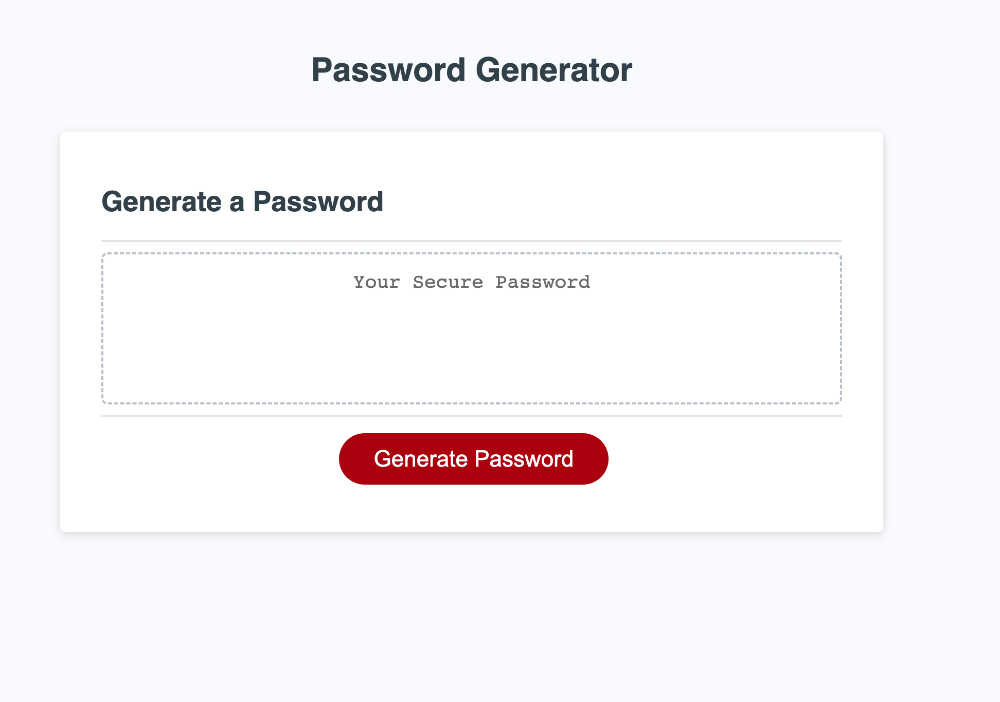

# CJames-Portfolio

> Live demo [_here_](https://cadienlake.github.io/password=generator/).

## Table of Contents

- [General Info](#general-information)
- [Screenshot](#screenshot)
- [Features](#features)
- [Project Status](#project-status)
- [Acknowledgements](#acknowledgements)

## General Information

-This is a password generator for creating a unique password meeting a set of criteria: password length, and the inclusion or lack thereof numbers, special characters, upper and lowercase letters.

## Screenshot

## Features

This portfolio website includes

- A button to execute the password generation
- A series of window alerts to confirm the desired length and character types
- Validation that the password length meets the criteria provided by the alert

## Project Status

Project is: _finished_.

## Acknowledgements

Give credit here.

- This project was created with assistance from our bootcamp instructor and student conversations. Thanks for the teamwork!
- Starter code was provided by the bootcamp!
